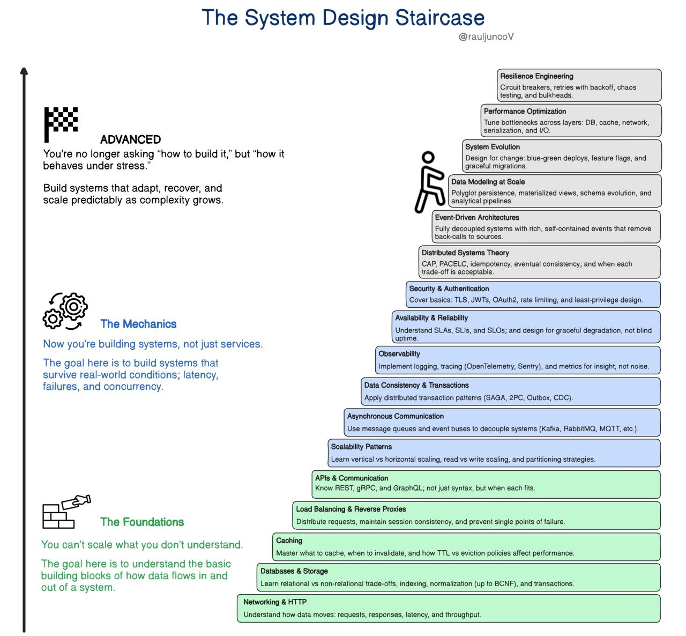

# 🧱 System Design Staircase — Learning Roadmap

A structured path for mastering **System Design**, progressing from understanding how data flows to designing systems 
that survive and evolve under stress.

---

## 🧱 The Foundations
> “You can’t scale what you don’t understand.”  
> Understand the basic building blocks of how data flows in and out of a system.

---

### 1. Networking & HTTP
Understand how data moves: requests, responses, latency, and throughput.  
**Core knowledge:** TCP/IP, DNS, HTTP/HTTPS, and how latency affects performance.

**🔗 Resources:**  
- [ What happens when you type a URL in your browser? ] (https://www.youtube.com/watch?v=4lb3dAtKcJo)
- [ What exactly is the HTTP protocol? ] (https://www.youtube.com/watch?v=SzwjnoPI--M)
- [ HTTPS, SSL, TLS & Certificate Authority Explained ] (https://www.youtube.com/watch?v=EnY6fSng3Ew)

---

### 2. Databases & Storage
Learn relational vs non-relational trade-offs, indexing, normalization (up to BCNF), and transactions.  
**Core knowledge:** SQL vs NoSQL, schema design, and how storage systems scale.

**🔗 Resources:**  
- [ ] Add link here

---

### 3. Caching
Master what to cache, when to invalidate, and how TTL vs eviction policies affect performance.  
**Core knowledge:** Redis, CDN caching, cache consistency, and latency reduction.

**🔗 Resources:**  
- [ ] Add link here

---

### 4. Load Balancing & Reverse Proxies
Distribute requests, maintain session consistency, and prevent single points of failure.  
**Core knowledge:** Nginx, HAProxy, round-robin vs least-connections algorithms.

**🔗 Resources:**  
- [ ] Add link here

---

### 5. APIs & Communication
Know REST, gRPC, and GraphQL — not just syntax, but when each fits.  
**Core knowledge:** API design, serialization (JSON, Protobuf), and client–server communication.

**🔗 Resources:**  
- [ ] Add link here

---

## ⚙️ The Mechanics
> “Now you’re building systems, not just services.”  
> Build systems that survive real-world conditions: latency, failures, and concurrency.

---

### 6. Scalability Patterns
Learn vertical vs horizontal scaling, read vs write scaling, and partitioning strategies.  
**Core knowledge:** Sharding, replication, and load distribution.

**🔗 Resources:**  
- [ ] Add link here

---

### 7. Asynchronous Communication
Use message queues and event buses to decouple systems.  
**Core knowledge:** Kafka, RabbitMQ, MQTT, and eventual consistency.

**🔗 Resources:**  
- [ ] Add link here

---

### 8. Data Consistency & Transactions
Apply distributed transaction patterns (SAGA, 2PC, Outbox, CDC).  
**Core knowledge:** Atomicity, isolation, and ensuring consistency across microservices.

**🔗 Resources:**  
- [ ] Add link here

---

### 9. Observability
Implement logging, tracing (OpenTelemetry, Sentry), and metrics for insight — not noise.  
**Core knowledge:** Metrics, tracing, dashboards, and root-cause analysis.

**🔗 Resources:**  
- [ ] Add link here

---

### 10. Availability & Reliability
Understand SLAs, SLIs, and SLOs; design for graceful degradation, not blind uptime.  
**Core knowledge:** Redundancy, failover, and graceful error handling.

**🔗 Resources:**  
- [ ] Add link here

---

### 11. Security & Authentication
Cover basics: TLS, JWTs, OAuth2, rate limiting, and least-privilege design.  
**Core knowledge:** API security, data encryption, and secure identity management.

**🔗 Resources:**  
- [ ] Add link here

---

## 🧠 Advanced
> “You’re no longer asking ‘how to build it,’ but ‘how it behaves under stress.’”  
> Build systems that adapt, recover, and scale predictably as complexity grows.

---

### 12. Distributed Systems Theory
CAP, PACELC, idempotency, eventual consistency; and when each trade-off is acceptable.  
**Core knowledge:** Fundamental constraints and guarantees in distributed design.

**🔗 Resources:**  
- [ ] Add link here

---

### 13. Event-Driven Architectures
Fully decoupled systems with rich, self-contained events that remove back-calls to sources.  
**Core knowledge:** Event sourcing, CQRS, and reactive architectures.

**🔗 Resources:**  
- [ ] Add link here

---

### 14. Data Modeling at Scale
Polyglot persistence, materialized views, schema evolution, and analytical pipelines.  
**Core knowledge:** Handling large-scale data systems and data lakes.

**🔗 Resources:**  
- [ ] Add link here

---

### 15. System Evolution
Design for change: blue-green deploys, feature flags, and graceful migrations.  
**Core knowledge:** Continuous delivery, rollbacks, and versioned deployments.

**🔗 Resources:**  
- [ ] Add link here

---

### 16. Performance Optimization
Tune bottlenecks across layers: database, cache, network, serialization, and I/O.  
**Core knowledge:** Profiling, indexing, query optimization, and async I/O.

**🔗 Resources:**  
- [ ] Add link here

---

### 17. Resilience Engineering
Circuit breakers, retries with backoff, chaos testing, and bulkheads.  
**Core knowledge:** Building fault-tolerant systems that recover under stress.

**🔗 Resources:**  
- [ ] Add link here

---

*Inspired by the “System Design Staircase” by [@rauljuncoV](https://twitter.com/rauljuncoV).*
